Hidden Gems: 10 Linux Commands You Probably Never Use (But Should)

# 🔍 Hidden Gems: 10 Linux Commands You Probably Never Use (But Should)

---

## 1. `alias`

Create shortcuts for long or frequently used commands.

**Example:**

*alias ll='ls -l'*

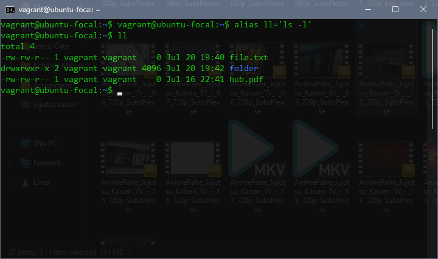

## 2. `unalias`

You can remove or temporarily disable an alias using the unalias command.

*unalias alias_name*

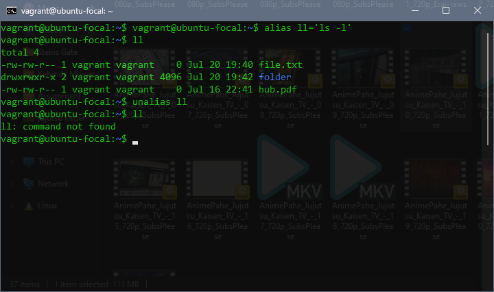

❗️To Remove All Aliases: *unalias -a*

⚠️ This removes all defined aliases in the current shell session.

**Important Notes:**

*Aliases you define this way are temporary — they last only for your current shell session.
To make an alias permanent, you must add it to your shell’s config file:*

Bash: ~/.bashrc or ~/.bash_profile  
Zsh: ~/.zshrc

**Example for permanent alias:**

*echo "alias ll='ls -lah'" >> ~/.bashrc*

## 3. `sort`
Sorts lines in a file alphabetically or numerically.

**Example:**

*sort names.txt*

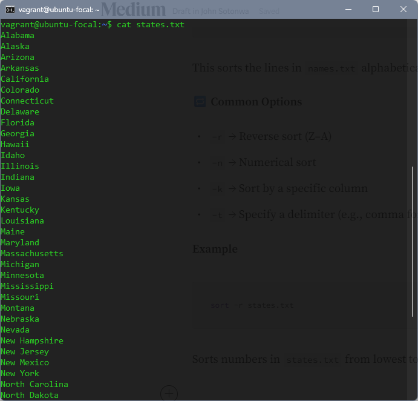

This sorts the lines in names.txt alphabetically (A–Z).

🔁 Common Options

- r → Reverse sort (Z–A)
- n → Numerical sort
- k → Sort by a specific column
- t → Specify a delimiter (e.g., comma for CSV)

**Example:**

*sort -r name.txt*

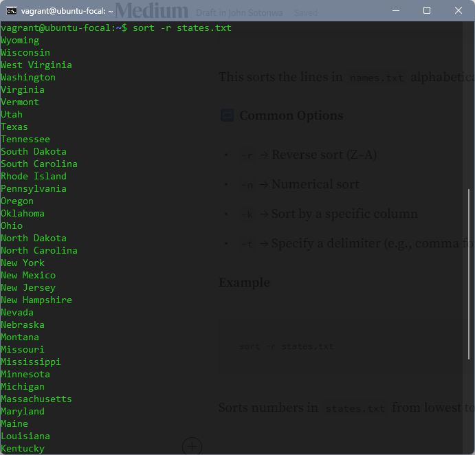

In this example, it sorts state.txt in reverse order.

## 4. `stat`
Shows detailed information about a file (size, time modified, permissions, etc.).

**Example:**

*stat file.txt*

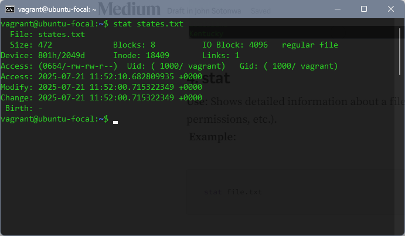

Shows when the file was last modified and its permissions.

## 5. `uniq`
Removes duplicate lines from a sorted file.

**Example:**

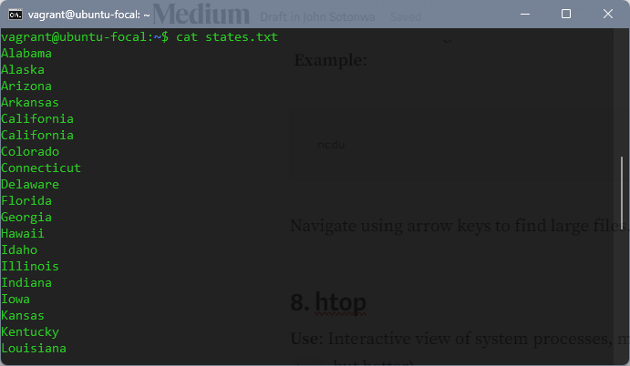

*sort file.txt | uniq*

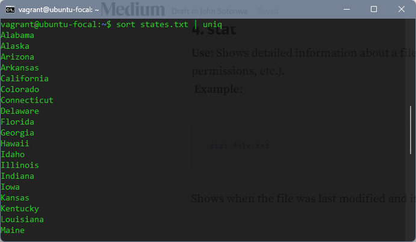

## 6. `tac`

Displays the contents of a file in reverse (last line first).

**Example:**

*tac file.txt*

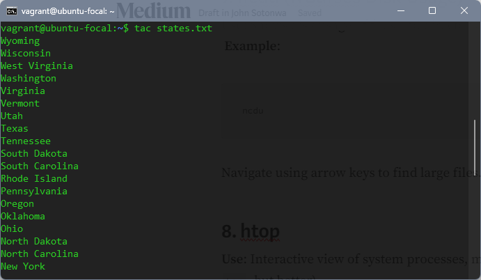

## 7. `htop`
Interactive view of system processes, memory, and CPU usage (like top, but better).

**Example:**

*htop*

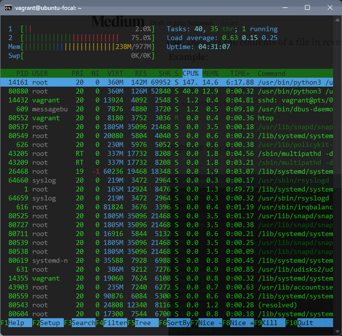

## 8. `nl`
Number lines in a file (more control than cat -n)

**Example:**

*nl filename.txt*

## 9. `shuf`
Shuffle lines randomly

**Example:**

*shuf filename.txt*

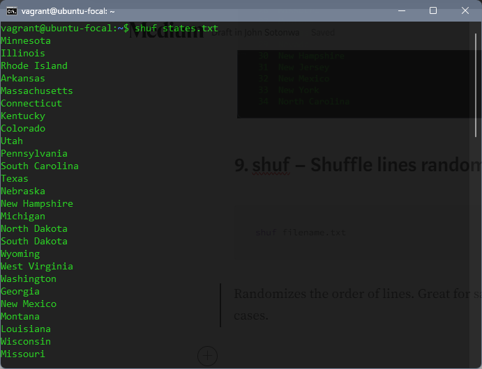

## 10. `history`
Lists previously executed commands.

**Example:**

*history*

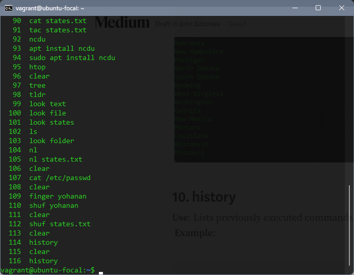

